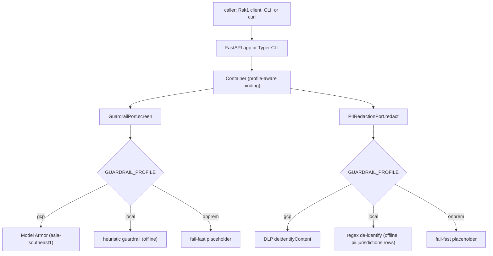
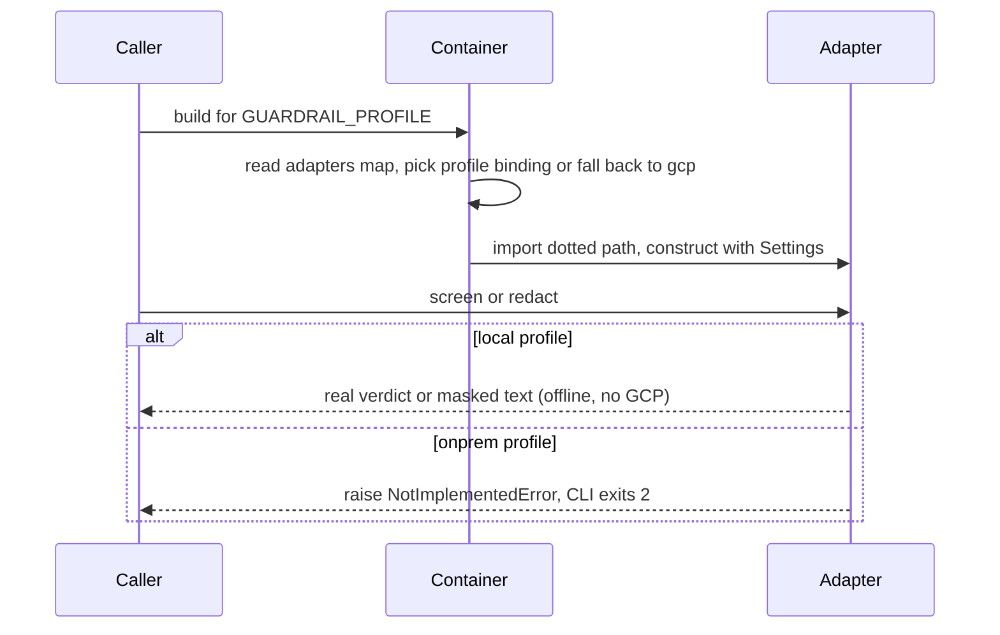

# Architecture: Hrz1 Agent Guardrail Gateway

Hexagonal ports-and-adapters. The HTTP surface and the CLI speak two domain Protocols; the
active `GUARDRAIL_PROFILE` binds each port to one of three interchangeable adapter families.

## Ports and adapter families

| Port (Protocol) | Method | `gcp` adapter | `local` adapter | `onprem` adapter |
|---|---|---|---|---|
| `GuardrailPort` | `screen(text, direction)` | `ModelArmorGuardrailAdapter` (Model Armor, regional) | `LocalHeuristicGuardrailAdapter` (injection / jailbreak / URL heuristics) | `OnPremGuardrailAdapter` (fail-fast) |
| `PIIRedactionPort` | `redact(text)` | `DlpRedactionAdapter` (DLP `deidentifyContent`) | `LocalRegexRedactionAdapter` (regex de-identify, rows selected by `pii.jurisdictions`) | `OnPremRedactionAdapter` (fail-fast) |

The dotted paths in `config/settings.yaml` under `adapters:` are the build contract, and
this table is their home; the rest of that file is specified in [`SPEC.md`](SPEC.md) §8 and
is not restated here. The `local` column carries no Google Cloud SDK and runs the whole
pipeline offline; the `onprem` column constructs and satisfies the Protocols, then raises.
All google-cloud imports in the `gcp` column are lazy (inside methods / `__init__`), so the
package imports and the `local` profile runs with no Google Cloud SDK installed.

The `local` redaction rows are composed in `adapters/local/heuristics.py:rules_for`: the
national-identifier rows and their checksum validators come from the shared, versioned
`pii-kit` for the configured `pii.jurisdictions`, and this repo adds the card, IP and
honorific-name rows the pack leaves to the application, in the order its card shape
dictates. One call builds both the rows the runtime redactor masks with and the rows the
offline eval gate scans with, so the two cannot drift apart.

The `local` guardrail adapter applies the `policy:` numbers (`block_categories`,
`block_min_confidence`) to the heuristic findings, so which findings block is configuration
rather than adapter code.

## Request flow

## Profile selection

## Layers

* **Domain** (`models.py`): frozen dataclasses + enums, pure standard library.
* **Ports** (`ports/safety.py`): two `@runtime_checkable` Protocols.
* **Adapters** (`adapters/{gcp,local,onprem}/`): the three families above, plus the
  `local` emulator opt-in scaffold (`adapters/local/_emulator.py`).
* **Config** (`config.py`, `config/settings.yaml`, `policy.py`): `Settings` +
  `${ENV:-default}` loader; the `policy:` and `pii:` sections parse into the frozen
  `GuardrailPolicy` / `PiiPolicy` (their key-by-key contract is [`SPEC.md`](SPEC.md) §8);
  `Container` binds ports to adapters by profile.
* **Wiring** (`api/app.py`, `cli/main.py`): FastAPI app and Typer CLI, both import-safe.
* **Eval** (`eval/run_eval.py`): offline promotion gate driving the `local` adapters.

## Residency

Region is pinned to `asia-southeast1` everywhere. The `gcp` profile uses the regional
Model Armor host and DLP location, per-service CMEK, internal-only Cloud Run ingress, and a
VPC-SC perimeter; no request or response content is logged. See `infra/terraform/`.
